## HackTheBox: Delivery

## TL;DR
#### Box with mattermost and os ticket with no known exploits. There is however some sort of 'misconfiguration' wherein we can use the email generated by the ticket, use it to register to mattermost and we'll get the confirmation link by viewing the ticket status. This technique is also known as 'TicketTrick'Once logged in to mattermost, we can see credentials of the maildeliverer user, ssh into it to find creds in the mysql database and crack the passwords to get root.

## Skills Learned
 - Email impersonation using ticket tricks
 - Advanced hash cracking tecniques using rule-based attacks

## Reconnaisance
#### Starting of with a simple nmap scan, we see two open ports namely ssh and http:

#### Browsing into the website reveals not much that can be potentially exploited. Running scans using gobuster did not find any directories. 
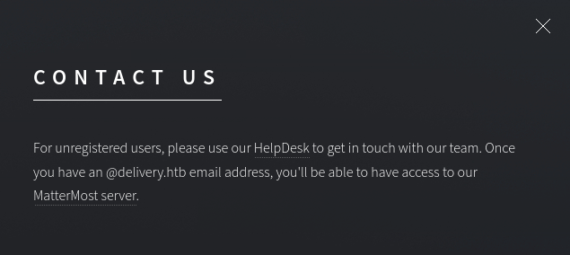
#### The contact-us page however gives us a subdomain `helpdesk.delivery.htb` and the port used for their mattermost server which is 8065. After we add the box ip then the subdomain to our /etc/hosts file, we can proceed to view those links that are mentioned. An interesting thing to note here is that we need an `@delivery.htb` email address to access mattermost.

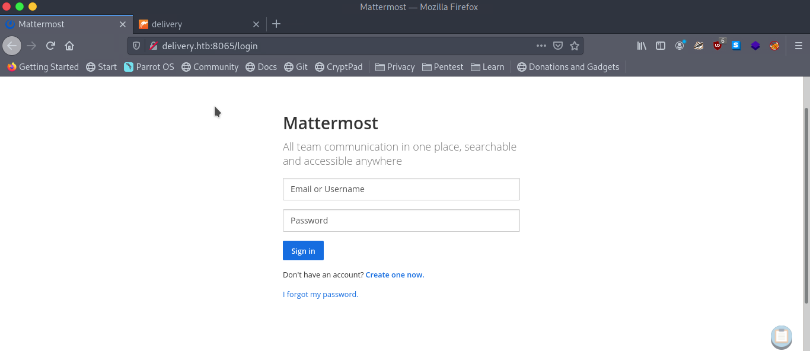
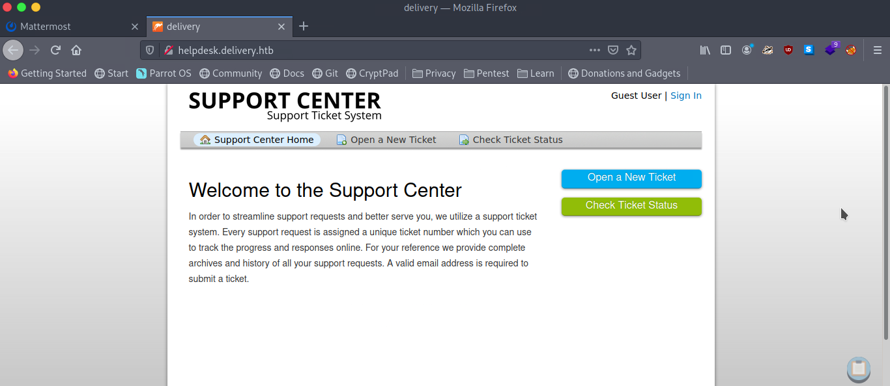

## Ticket Tricks
#### Searching for vulnerabilities/exploits on OSTicket (which is used by the helpdesk) didn't return much that we can use. Playing around by creating a support ticket gives us a potential tool for our attack as it gives us our very own `@delivery.htb` email address. 

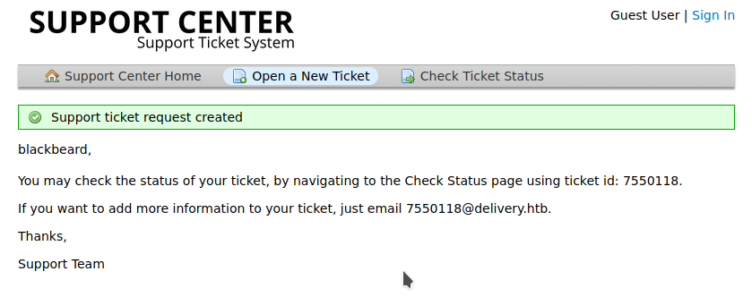

#### We can now try to signup for the mattermost service using the generated email, but it seems that we need to click on a confirmation link sent to that address somehow.
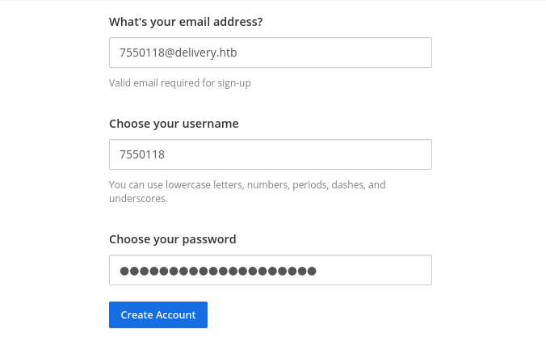

#### To view this confirmation email, we can simply view the status of our ticket on the helpdesk:
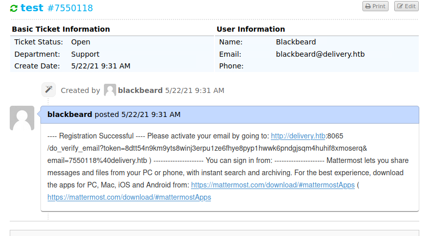

## Foothold + User
#### Now that we have access to the mattermost server, we can continue to view their 'internal' channel and there we are presented with credentials and some hints regarding password variations.
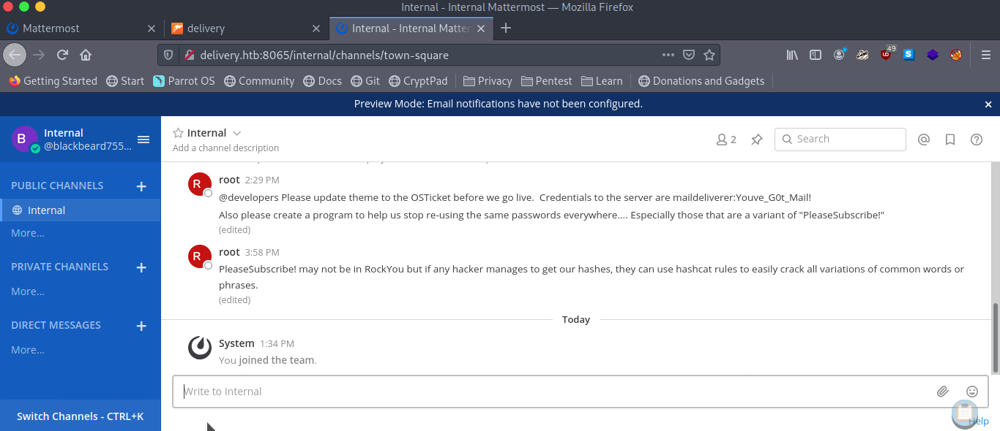

#### We can use the `maildeliverer:Youve_G0t_Mail!` credential to login into the box using ssh and from this foothold we can simply get the user.txt file.
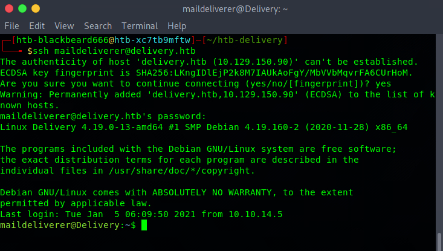

## Privesc, pt.1 
#### While doing some manual enumeration on the file system, we can find another set of credentials in the mattermost configuration files, this time credentials to the mysql database where mattermost stores its user data.
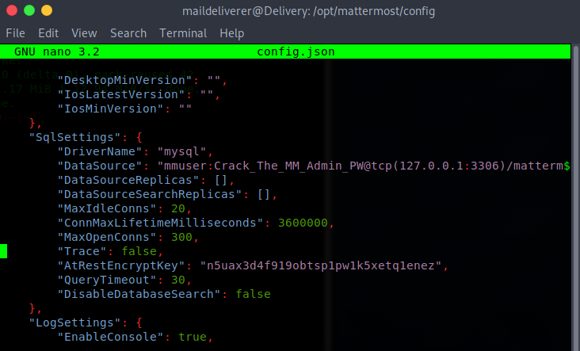
#### With simple query work, we can retrieve the password hashes of all the users in the mattermost instance.
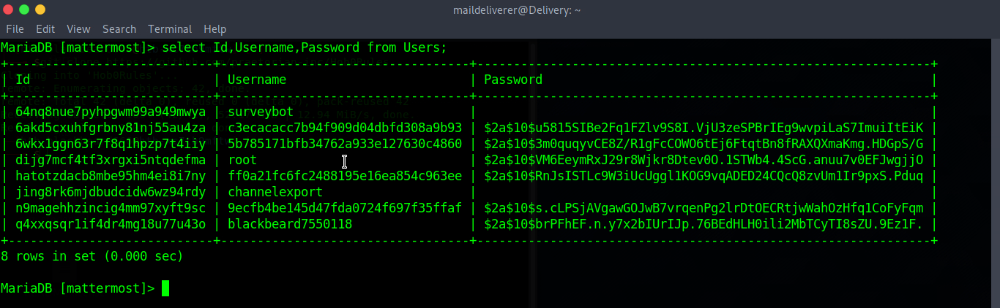

## Privesc, pt.2
#### Now it boils down to the task of cracking the root hash. If we recall the message on the internal channel: `PleaseSubscribe! may not be in RockYou but if any hacker manages to get our hashes, they can use hashcat rules to easily crack all variations of common words or phrases.`
#### This hints that we need to do a rule-based attack on the string `PleaseSubscribe!` to retrieve the root password. A quick google search provides us some links to password rules that we can use, for example [Hob0Rules](https://github.com/praetorian-inc/Hob0Rules).
#### I decided to use the d3adhob0 ruleset which took quite some time to crack it, but crack it it did. Command used: `hashcat -a 0 -m 3200 root.hash rockyou.txt -r d3adhob0.rule -o cracked.hash`
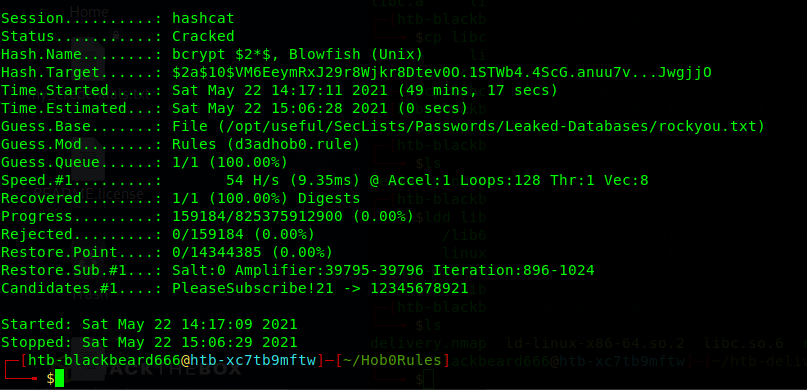
#### Took almost an hour, but it's worth the wait as it cracked the hash and returned the password as `PleaseSubscribe!21`. We can now use this password to `su` into the root account of the box and get the corresponding flag.
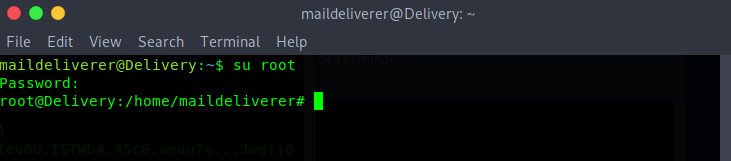

## Resources
[How I hacked hundreds of companies through their helpdesk](https://medium.com/intigriti/how-i-hacked-hundreds-of-companies-through-their-helpdesk-b7680ddc2d4c)