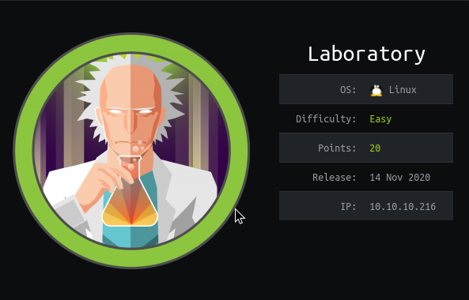
## HackTheBox: Laboratory

## Background Information
#### A pretty satisfying solve. Initially I wanted to solve this without asking for any help from others, smooth sailed to an initial foothold couldn't get ideas on how to proceed after. Solved this once again with the help of 1z3n, check out his stuff. If I made errors/mistakes, hit me up on discord and help me to better understand what I did wrong :)

## Enumeration
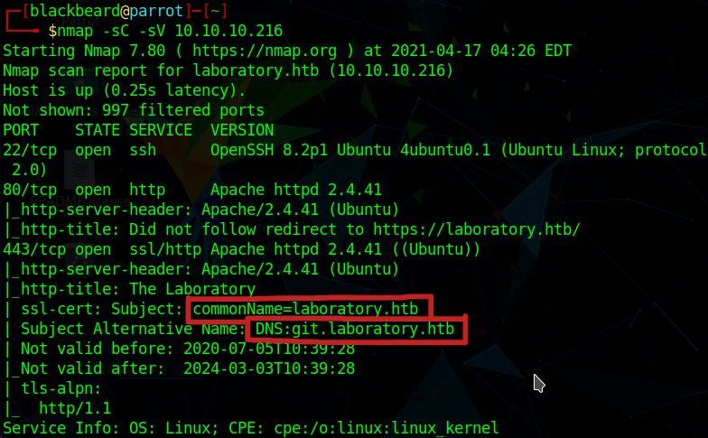
#### Starting off with an nmap scan, we see that 3 ports are open: ssh, http, and ssl. We also see some additional information such as the domain name `laboratory.htb` and a subdomain `git.laboratory.htb` which we will add entries for in our /etc/hosts file. I did some more subdomain fuzzing with ffuf but as it returned nothing apart from the aforementioned subdomain, I left it at that and proceeded to enumerate on `laboratory.htb`.

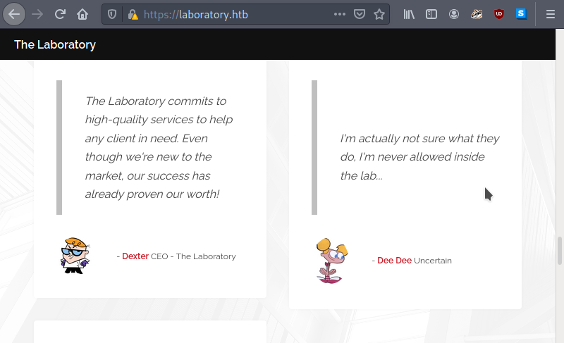
#### Nothing much to see here apart from some background story to the challenge and some potential users in the form of Dexter (which is the CEO) and Dee Dee, characters from a nostalgic childhood cartoon, Dexter's Lab. Performing some directory searches with gobuster and scanning source code doesn't reveal much. 

#### We then proceed to enumerate `git.laboratory.htb`, which shows a gitlab dashboard. Since we haven't found any user credentials, we can create one which we can use to login. Note that the registration will only accept emails that end in `@laboratory.htb`.
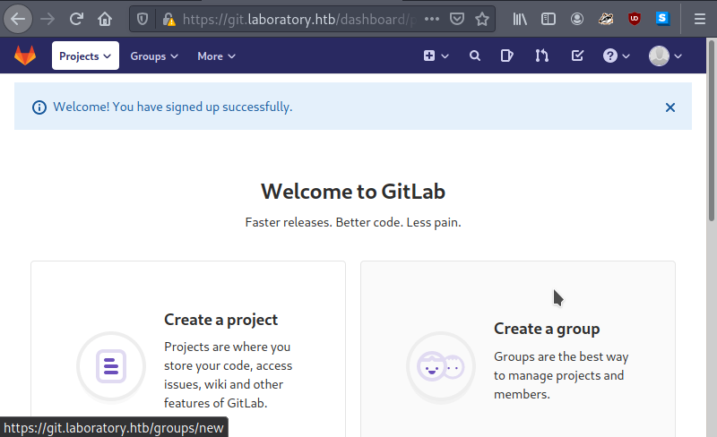

## gitlab exploit ideas

#### Further enumeration reveals that the gitlab version used is 12.8.1, which is vulnerable to some of the exploits that searchsploit has returned:
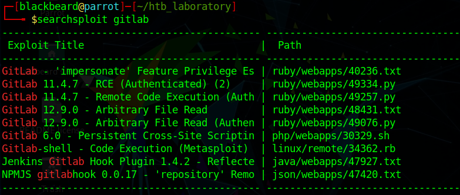

#### Two of the exploits are what we will be testing on the service, the authenticated arbitrary file read to be particular. Reviewing the code reveals that it uses a local file inclusion/directory traversal to read sensitive files that we provide. 
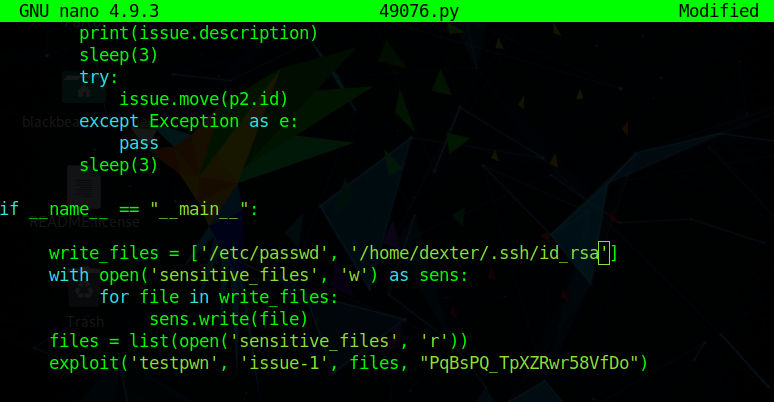

#### The exploit logs in as our user with the token that we have provided, opens two projects and writes the arbitrarily read file as an issue. Downloading the attachment reveals the entries in the machines' /etc/passwd file.
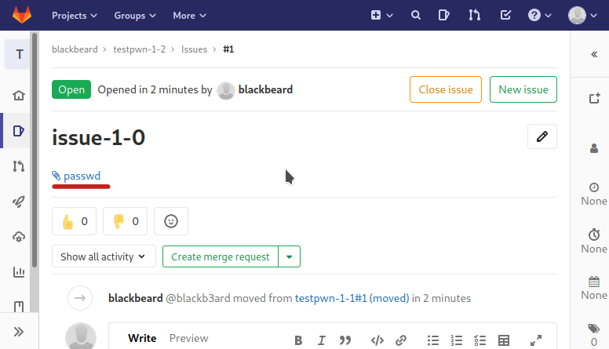

#### The idea was to retrieve something with credentials or an private ssh key, but experimenting/guessing returned nothing so I browsed for other alternatives which lead me to this [repository](https://github.com/dotPY-hax/gitlab_RCE). 

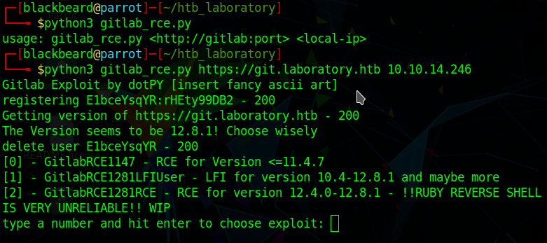
#### After tweaking with it a little bit to fine out the warnings/errors that it returned, running the script and following the instructions popped a shell (an unstable one, but a shell is a shell). I started another listener and opened another bash reverse shell to get a more stable one.

## initial foothold: uid=998(git)
#### We begin the process of enumeration again to find out possible attack vectors and one idea that I thought of was using the gitlab-rails console. It took me quite a while to surf through the gitlab-rails documentation, but I found a promising idea [here](https://docs.gitlab.com/ee/administration/troubleshooting/navigating_gitlab_via_rails_console.html) which allowed me to find the user account for `dexter` and some other important information like his email and encrypted password as seen below:
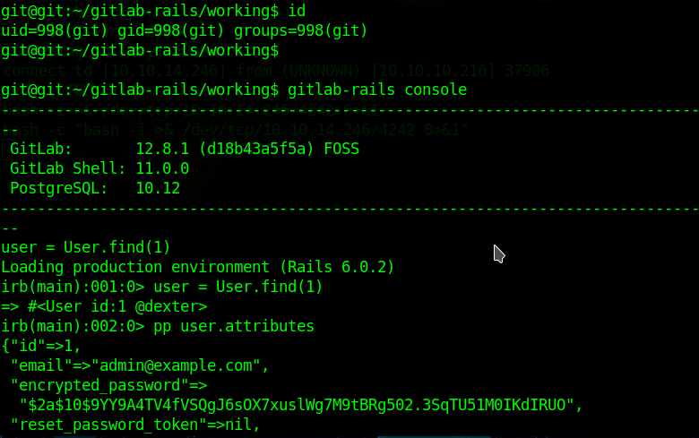

#### While hashcat was running on the background, I also came accross the idea of modifying active record objects or in short changing the password of the dexter account. We can simply update his password, save it into the database and if it returs true, we can login using the creds that we have (email: `admin@example.com`, password: `password`)

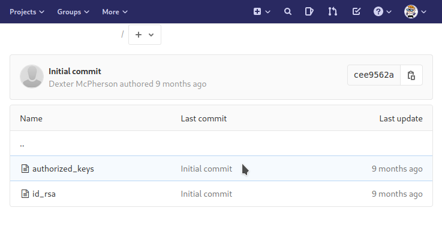
#### And yes we were able to successfully login as dexter! Looking through his projects reveal an interesting directory which contains a private rsa key. We can now try to ssh into the box using the private key.

## uid=1000(dexter)

#### What's left to do is to escalate our priviledges into the root user. Opened up a python http.server to get the automated scripts that we need, in this case linpeas. Sifting through the linpeas output, we see a rather interesting binary which has its SUID bits set:
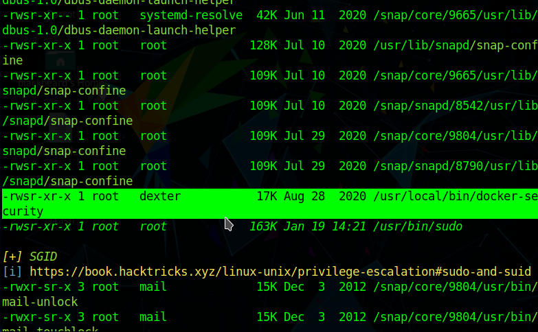

#### It's my first time learning of docker-security and I was stumped for a bit again after googling didn't return concrete ideas. I only had experience with privescs using docker in tryhackme, but since we aren't part of the docker group nor does the docker binary have suid/above permissions that isn't possible. An idea I had was to disassemble the docker-security binary to find out it's inner workings and I was able to find out a possible vector:
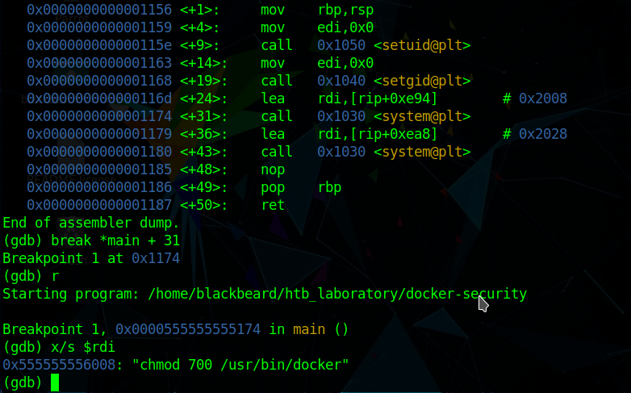

#### On `*main + 31`, we get a call to system with `chmod 700 /usr/bin/docker` as an argument. We can deduce that this can be vulnerable to a path variable manipulation exploit, as we can change chmod to be something like /bin/sh so that when we run the binary, /bin/sh gets called instead. The following steps are the help that I got from 1z3n, which allowed me to pop a root shell:
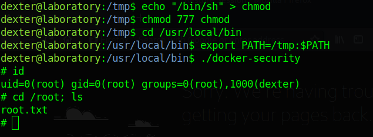
